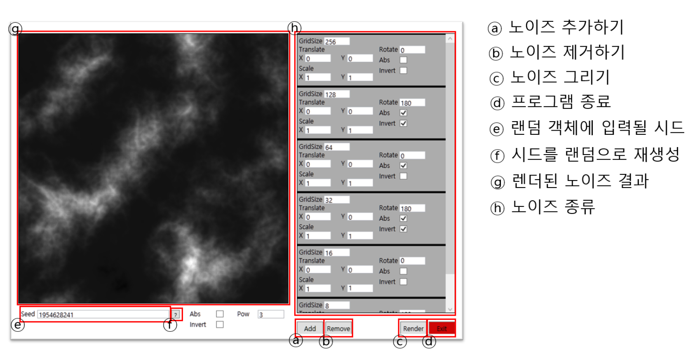

이 프로젝트는 공부 목적으로 작성되었습니다.

PerlinNoise를 GridSize를 변경하며 생성하고, 간단한 아핀 변환(Translate, Rotate, Scale)을 수행한 결과를 합칩니다.
Fractal Brownian Motion 알고리즘을 통한 노이즈 생성을 시뮬레이트합니다.

### 사용법

#### 주의할 점!
 - GridSize는 \(2^n\) 형태만 받습니다.
 - Noise의 Scale값은 0 이하로 내려갈 수 없습니다.
 - 만약 렌더 불가능한 값이 입력된 경우, 노이즈 설정의 오른쪽 위에 빨간 네모가 보여지며, 이 경우 렌더 과정에서 해당 노이즈는 무시됩니다.
 - 렌더 결과 밑의 Abs, Invert, Pow는 최종 결과 값에 적용됩니다.
   - Abs : 절대값 적용
   - Invert : 1 - α 값 적용 [검정 영역 -> 흰 영역, 흰 영역 -> 검정 영역]
   - Pow : v^(pow) 적용 [대비 극대화]
